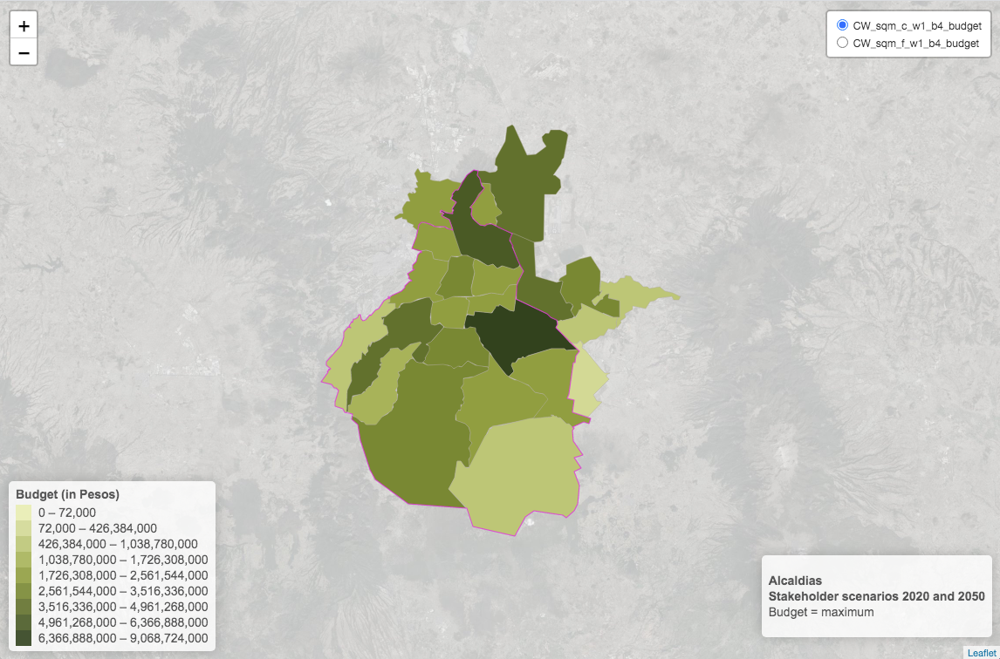

# Socio-hydrological resilience dataset Mexico city and Metropolitan Area

Original Publish Date: 26 May, 2021  
Updated on: 01 Jun, 2021

This page describes the technical specifications of the *Socio-hydrological resilience dataset for Mexico city and its Metropolitan Area*. The data is presented as geometric polygon features representing administrative areas.

## Methodology

This research project was developed by the British Geological Survey, the Architectural Association, the Centre for Advanced Spatial Analysis and Fluxus. For more information about the project and methodology visit the project [website](https://www.mexicoshr.com/).

## General description

The dataset comprises a set of variables that describe socio-hydrological vulnerability and the effects of building constructed wetlands for geographic areas called Colonias (n = 2785). Additionally, the effects of constructed wetlands are summarised at larger administrative areas called Alcaldias (n = ). The variables represent a description of the baseline (no constructed wetlands) for the **actual 2020 and future 2050** situations and the estimation of the impacts of **4 budget schemes**. Socio-hydrological vulnerability is represented by a **Socio-hydrological index (SHI)** which is the quotient between the **Water Stress index (WSI)** and the **Adaptive Capacity index (ACI)**.

The impact of **Constructed Wetlands (CW)** in each Colonia is presented as the total amount of CW measured in square meters, and measured as total budget when this variable is aggregated to Alcaldias. Finally, the indexes and effects of CW (SHI, WSI, ACI and CW) are calculated for **3 world-views scenarios; Stakeholder, Environmental and Social**. As illustrated in the data-cube figure below the combination of these parameters make up 120 variables for Colonias and 30 variables for Alcaldias (budget 0 variables for CW should be removed as this budget produces no impact making a final total of 114 and 24 variables)

## Codebook

The name of the variables is created from a string of the different parameters according to the following table. For example, the variable "ACI_c\_w1_b1" corresponds to Adaptive Capacity index for 2020, Stakeholder weighting and budget 1

| Variable name | Variable description                                      |
|---------------|-----------------------------------------------------------|
| ID_Colonia    | unique numeric identifier for Colonia                     |
| Municipality  | Name of Alcaldia (similar to Borough)                     |
| Colonia       | Name of Colonia (similar to LSOA)                         |
| pop           | Total population (by Colonia)                             |
| SHI           | Socio-hydrological vulnerability index                    |
| WSI           | Water Stress index                                        |
| ACI           | Adaptive Capacity index                                   |
| CW_sqm        | Constructed Wetlands in square metres                     |
| CW_perc       | Percentage of homes with CW                               |
| c             | current 2020                                              |
| f             | future 2050                                               |
| w1            | Stakeholder (weighting)                                   |
| w2            | Environmental (weighting)                                 |
| w3            | Social (weighting)                                        |
| b0            | no constructed wetlands                                   |
| b1            | 10,000 constructed wetlands                               |
| b2            | 100,000 constructed wetlands                              |
| b3            | 500,000 constructed wetlands                              |
| b4            | maximum constructed wetlands                              |
| cl            | class. The index (SHI, WSI, ACI) reclassified into levels |
| budget        | Total budget invested in CW by Alcaldia                   |

## Indices classes (or levels) & colour schemes

The values of all indices (SHI, WSI and ACI) are categorised and organised according to the following tables of value breaks, classes and colours

### SHI

|   Value   |    Class     |  Colour  |
|:---------:|:------------:|:--------:|
| 0.0 - 0.6 | Little to no | \#003496 |
| 0.6 - 0.8 | Little to no | \#567bbb |
| 0.8 - 1.0 | Little to no | \#adc3e0 |
| 1.0 - 1.2 |   Moderate   | \#fef9e4 |
| 1.2 - 1.4 |   Moderate   | \#fee2a4 |
| 1.4 - 1.6 |   Moderate   | \#fdca65 |
| 1.6 - 1.8 |   Moderate   | \#fdb225 |
| 1.8 - 2.0 |   Moderate   | \#ee8311 |
| 2.0 - 2.2 | Significant  | \#d4411e |
| 2.2 - 2.4 | Significant  | \#bd1a21 |
| 2.4 - 2.6 | Significant  | \#ab1319 |
| 2.6 - 2.8 | Significant  | \#990d10 |
| 2.8 - 3.0 | Significant  | \#870608 |
| 3.0 - 8.0 |   Extreme    | \#750000 |

### WSI

|   Value   |   Class   |  Colour  |
|:---------:|:---------:|:--------:|
| 0.0 - 0.1 | Very low  | \#ffffff |
| 0.1 - 0.2 | Very low  | \#ffffff |
| 0.2 - 0.3 |    Low    | \#ffffff |
| 0.3 - 0.4 |    Low    | \#ffffff |
| 0.4 - 0.5 | Moderate  | \#ffffff |
| 0.5 - 0.6 | Moderate  | \#dff6fa |
| 0.6 - 0.7 |   High    | \#87cce1 |
| 0.7 - 0.8 |   High    | \#2fa2c7 |
| 0.8 - 0.9 | Very high | \#01568b |
| 0.9 - 1.0 | Very high | \#00316b |

### ACI

|   Value   |   Class   |  Colour  |
|:---------:|:---------:|:--------:|
| 0.0 - 0.1 | Very low  | \#00403F |
| 0.1 - 0.2 | Very low  | \#005651 |
| 0.2 - 0.3 |    Low    | \#006D64 |
| 0.3 - 0.4 |    Low    | \#008476 |
| 0.4 - 0.5 | Moderate  | \#009B89 |
| 0.5 - 0.6 | Moderate  | \#19B09E |
| 0.6 - 0.7 |   High    | \#4CC2B6 |
| 0.7 - 0.8 |   High    | \#7FD5CE |
| 0.8 - 0.9 | Very high | \#B2E7E6 |
| 0.9 - 1.0 | Very high | \#E5FAFE |

The [interactive](https://npalomin.github.io/BGS/2bu_2ye.html) mock-up shows the map legends for SHI, WSI and ACI maps. This mock-up also shows the information included in Tooltips.

This [interactive](https://npalomin.github.io/BGS/alcaldia.html) maps shows calculations of CW at Alcaldia level. The budget values come from the following formula

| Budget         | Formula         |
|----------------|-----------------|
| Budget (pesos) | CW_sqm \* 18000 |

### CW colour scheme

The breaks for the CW maps are created with the natural break or "jenks" algorithm. The table shows the breaks and corresponding colour from lower (1) t higher (10)

| Break | Colour  |
|:-----:|:-------:|
|   1   | #EAEBB2 |
|   2   | #D6D996 |
|   3   | #C3C87B |
|   4   | #B0B760 |
|   5   | #9CA645 |
|   6   | #889334 |
|   7   | #727F2E |
|   8   | #5D6A28 |
|   9   | #475522 |
|  10   | #32411C |

## Files

The files containing the data are detailed below

| Name                    | Description                                                                                                                                                             | Download URL                                                                                 |
|-------------------------|-------------------------------------------------------------------------------------------------------------------------------------------------------------------------|----------------------------------------------------------------------------------------------|
| colonias_all_nc.geojson | 2785 features with 142 fields and geometry type Polygon. This file doesn't have a class descriptor for indices (nc- no class)                                           | <https://raw.githubusercontent.com/npalomin/shi_dataset_cdmx/master/colonias_all_nc.geojson> |
| colonias_all_wc.geojson | 2785 features with 232 fields and geometry type Polygon (90 additional fields with 'class' variable). This file has a **class** descriptor for indices (wc- with class) | <https://raw.githubusercontent.com/npalomin/shi_dataset_cdmx/master/colonias_all_wc.geojson> |
| alcaldias.geojson       | 23 features and 25 fields and geometry type MultiPolygon                                                                                                                | <https://raw.githubusercontent.com/npalomin/shi_dataset_cdmx/main/alcaldias.geojson>         |
| cdmx.geojson            | 1 feature showing administrative boundary of Mexico City                                                                                                                | <https://raw.githubusercontent.com/npalomin/shi_dataset_cdmx/main/cdmx.geojson>              |

## Benefits variables

The impacts of the CW is shown as a series of benefits variables (on a side summary panel). These can be calculated from the CW_sqm and CW_perc variables according to the following table.

| Benefit                    | Formula          |
|----------------------------|------------------|
| Population impacted        | CW_perc \* pop   |
| Homes impacted             | CW_sqm / 2       |
| Water filtered yearly (lt) | CW_sqm \* 18000  |
| Rain filtered yearly (lt)  | CW_sqm \* 6000   |
| Cattail plants yearly      | CW_sqm \* 3      |
| Arum lilies yearly         | CW_sqm \* 32     |
| Maintenance jobs           | CW_sqm \* 0.0625 |
| Manufacture jobs           | CW_sqm \* 0.0115 |

This [interactive](https://npalomin.github.io/BGS/coloniaCW.html) map shows the benefit variables for each Colonia in the corresponding tooltip

## NA values

Occasionally some variables show NA values. This occurs when it was not possible to compute the value due to missing data or when there is no constructed wetland built.
